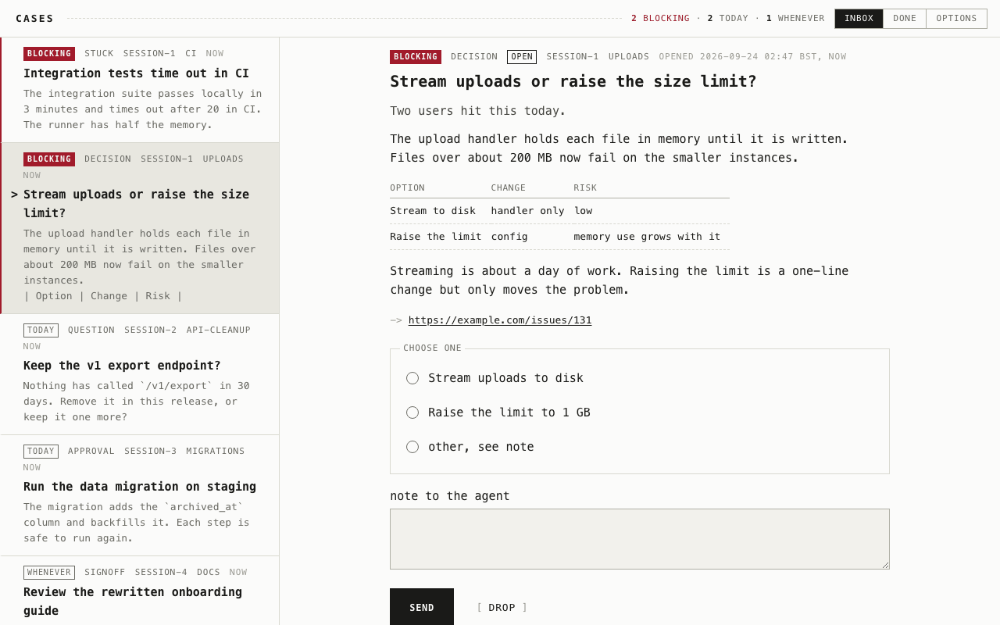
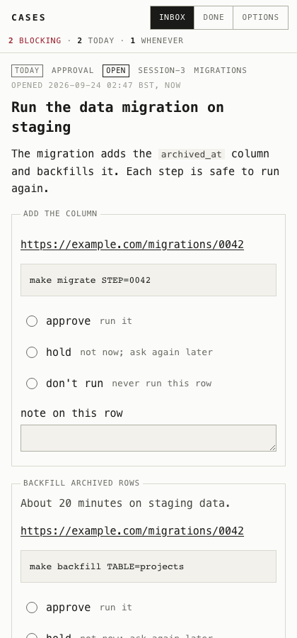

# cases

`cases` is a Go CLI for passing questions from a coding agent to a human and
getting the answer back. The question is called a case.

1. The agent opens a case: a decision to make, scripts to approve, work to
   sign off, a blocker, or something the human should know.
2. The agent waits in the background.
3. The human answers from the terminal or from a local web inbox
   (`cases serve`).
4. The agent picks up the answer, acts on it, and closes the case with what
   happened.

The cases live in one SQLite file on this machine, and every event is kept as
it was written. No server is needed.

<picture>
  <source media="(prefers-color-scheme: dark)" srcset="docs/images/inbox-dark.png">
  
</picture>

## Why

A coding agent that needs a decision usually asks in its terminal and stops
until someone reads it. With a few agents running, the questions are spread
across terminals, and an agent can wait for hours on a question nobody has
seen. When the session ends, the question and its answer go with it.

cases gives every agent one place to put its questions, lets the human answer
them in one inbox, and keeps each question, answer and outcome as a record.

## Install

With Homebrew, on macOS or Linux:

```sh
brew install ryanlewis/tap/cases
```

Or download the archive for your platform from the
[latest release](https://github.com/ryanlewis/cases/releases/latest) and
verify it against the published checksums:

```sh
gh release download vX.Y.Z -R ryanlewis/cases -p 'cases_X.Y.Z_<os>_<arch>.*' -p checksums.txt
sha256sum -c checksums.txt --ignore-missing
tar -xzf cases_X.Y.Z_<os>_<arch>.tar.gz cases   # unzip the .zip on windows
install cases /usr/local/bin/cases
```

GitHub also keeps a build provenance attestation for each archive, which
shows that this repository's release workflow built it from the tag:

```sh
gh attestation verify cases_X.Y.Z_<os>_<arch>.tar.gz -R ryanlewis/cases \
  --signer-workflow ryanlewis/cases/.github/workflows/release.yml \
  --source-ref refs/tags/vX.Y.Z
```

The macOS binaries are signed and notarized. The binary includes SQLite;
nothing else needs installing.

Or install from a checkout with Go on the path:

```sh
git clone git@github.com:ryanlewis/cases.git
cd cases
make install    # go install ./cmd/cases
```

Then install the agent skill. It teaches the agent when to open a case, how to
wait for the answer and how to act on it. It supports Claude Code, Codex and
Pi; see [the agent skill](#the-agent-skill).

```sh
cases skill install claude    # also: codex, pi
```

## A first case

This runs one case end to end in the default store,
`~/.local/share/cases/cases.db`. In real use an agent runs the agent's
commands; to try it, run both sides in one shell.

```sh
# Agent: raise a decision and wait for the answer in the background.
echo "Pin bun to 1.2.3, or float it and fix the lockfile when it breaks?" > question.md
id=$(cases open --kind decision --urgency blocking --title "Pin bun or float?" \
  --body-file question.md --option "Pin to 1.2.3" --option "Float and fix the lockfile")
# --since "$id" stops wait missing an answer that lands before it starts.
cases wait --id "$id" --since "$id" --timeout 2h > answered.jsonl &

# Human: answer it, from here or from the inbox that cases serve opens.
cases answer "$id" --option 1 --note "Revisit after 1.3"

# Agent: record that the answer was read, act on it, and close with the outcome.
cases pickup "$id" --by bun-pins
cases close "$id" --outcome "Pinned in #12."
cases show "$id"
```

## The web inbox

`cases serve` runs a web inbox over the store at `http://127.0.0.1:8765/`
and opens it in the browser. It only listens on loopback.

<picture>
  <source media="(prefers-color-scheme: dark)" srcset="docs/images/case-dark.png">
  
</picture>

- The left column lists open and parked cases, blocking first, then oldest
  first. The right side shows the selected case with a form that fits its
  kind: options for a decision, a verdict per row for an approval, a text
  box for a question.
- The page follows the store. A new case, a note or an amend shows up without
  a reload, and the tab title counts the open cases.
- If the question changes while you are answering it, the send is refused and
  the case is shown again, so you do not answer a question you have not read.
- `done` lists the cases that are answered, picked up, closed or withdrawn.
- `j` and `k` move through the list, `1` to `9` choose an option, and
  Cmd+Enter or Ctrl+Enter sends the answer.
- Under `options` you can set the theme, the font and the text size, and turn
  on desktop notifications for new cases.
- On a narrow window, such as a phone, it shows one column.

To keep the inbox running, `cases service install` sets `cases serve` up as a
user service (launchd on macOS, systemd on Linux) that starts at login.

The full description is in [docs/serve.md](docs/serve.md).

<br clear="right">

## The agent skill

The agent skill is a `SKILL.md` embedded in the binary, so it always matches
the commands the binary has. It is written for an agent: the lifecycle, the
kinds and what each answer looks like, the agent-side commands, what not to do,
and a recipe for open, wait, pickup and close.

```sh
cases skill install claude   # also: codex, pi
cases skill list             # each agent, where the skill goes, and whether it is installed
cases skill check            # exit 1 if an installed skill differs from this binary
```

Where each agent's skill goes, and how install and uninstall behave, is in
[docs/skill.md](docs/skill.md).

## Documentation

- [CLI](docs/cli.md): every command and flag, exit codes, `wait`'s output,
  and clearing the inbox with `sweep` and `prune`.
- [serve](docs/serve.md): the web inbox, finding a running serve, running it
  as a service, keys and browser notifications.
- [Store format](docs/store.md): the SQLite tables, how writes work, the
  states, the kinds and their answers, the archive and damaged events.
- [Configuration](docs/configuration.md): the config file and its keys.
- [skill](docs/skill.md): the bundled agent skill.
- [Development](docs/development.md): building, testing and cutting a release.

## License

MIT
